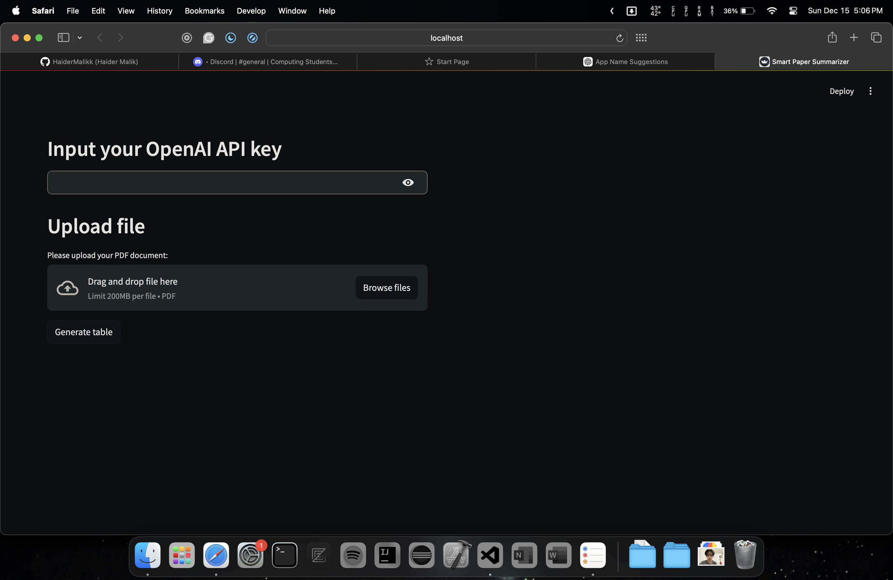
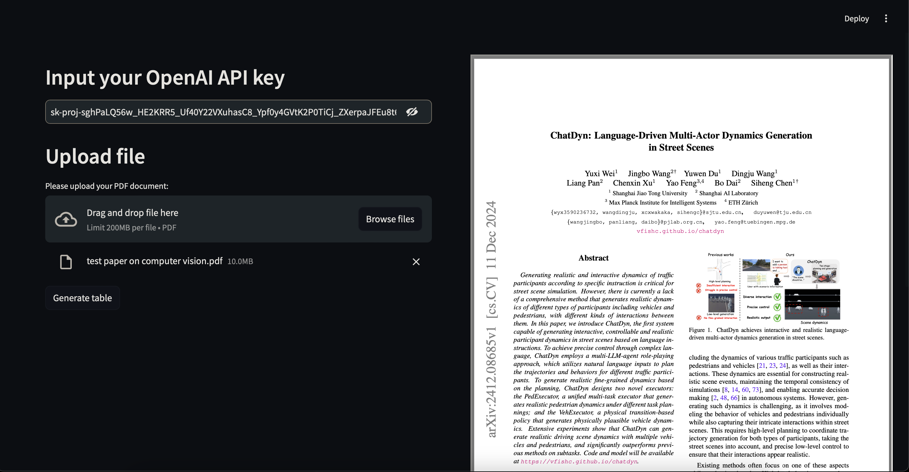
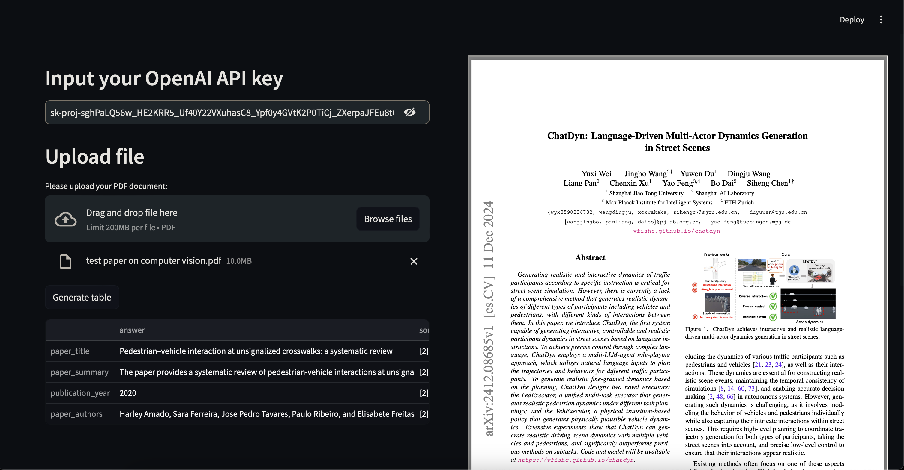
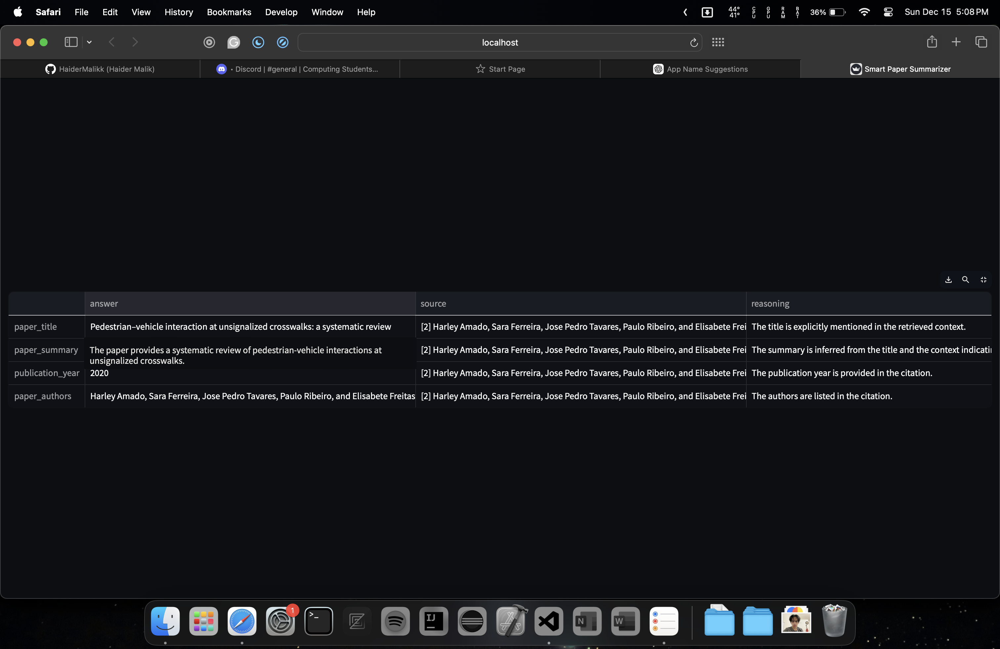
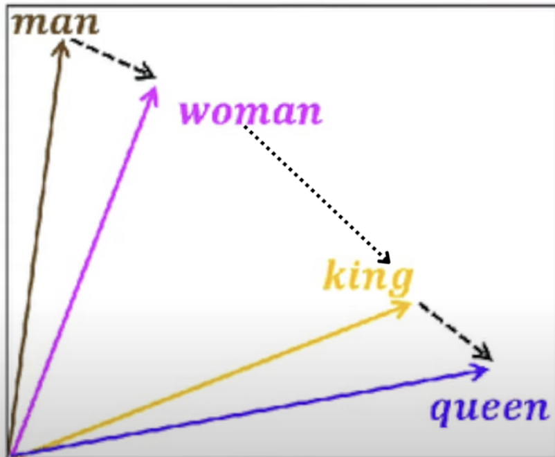

### Project Summary
**Smart Paper Summarizer** is an AI-driven tool designed to efficiently summarize educational research papers. The project leverages several key technologies to extract, store, and process information from PDFs:

- BACKEND
1. **PDF Extraction**: Uses PyPDF to extract text from educational PDFs this process splits the text into 'chunks' or 'words'. We make sure we don't end the set chunk in the middle of a sentence, a ex is we only break on a new line only. Additionally some chunks overlap with other chunks, this is because we dont want to end our set of chunks 'i.e part of the pdf' in a middle of a idea by overlapping we ensure that some context if given to each set of chunks from the prevoius set of chunks.
2. **Text Embeddings**: Utilizes OpenAI's Ada model to generate embeddings for the extracted text. This process enables the model to capture semantic relationships between words and phrases which allows us to capture the meaning of the question we ask. In simple terms, we can get the words from the pdf that closely match the words in the question.
3. **Storage & Retrieval**: Implements Chroma as a vector database to store and query the text embeddings. This database is unique to the pdf and does not contain duplicate chunks. Just like we mentioned above in each query we search and get the most similar chunks to the questions.
4. **Summarization**: The embeddings and context from the PDF are used to generate prompts for OpenAI's GPT-4 mini, which serves as the core large language model (LLM) for producing concise summaries. The prompt is custom-made and includes not only the context and question but specific instructions to the model to make sure the summary is accurate and to the point.
5. **Structuring** The final prompt is given as a structured response, this response is then formatted into a table with the help of pandas and the final summary is displayed in a user-friendly format. The answer includes not only the answer but the reasoning behind it along with in text citations.
NOTE: The temperature of the model is low and specifically chosen to avoid any bias and make sure the model only works with the data at hand and not with any external information, in short, this limits its creativity giving us a more accurate summary.

- FRONTEND
1. **User Interface**: The UI is designed and implemented using Streamlit, providing an intuitive interface for users to upload PDFs. This PDF can be viewed by the user once they have uploaded it. Once the user has given their openai key they can generate the summary. This summary is then displayed in a table format to the user.

- Here are some pictures of the Project: 

- Note on text embeddings
Text embeddings are numerical representations (vectors) of text that capture the semantic meaning of words, phrases, or entire passages. These embeddings are generated by machine learning models (e.g., OpenAI's Ada), which map similar meanings to vectors that are closer together in space.
Text embeddings allow you to find meaningfully similar chunks of text rather than just relying on keyword matching. This makes it easier to retrieve relevant content from the PDF based on the user's query. By retrieving the most relevant chunks using embeddings, you ensure that the LLM (GPT-4 mini) works with contextually appropriate information, leading to more accurate and concise summaries.

look at this ex, here the words 'man' and 'woman' are closer in space than 'man' and 'queen' this means that if the question included 'man' and the pdf had 'woman' it would be a good match. for that word and hence could be added to the context of the question.
     
